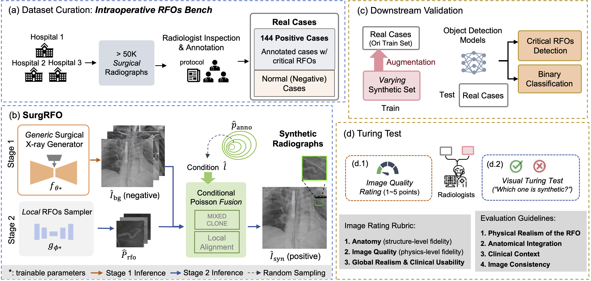

# SurgRFO: Compositional Synthesis of Critical Retained Foreign Objects in Intraoperative Chest X-rays

Official implementation of **SurgRFO**, a two-stage synthesis framework for generating realistic intraoperative radiographs with critical
retained foreign objects (RFOs).

Paper: *SurgRFO: Foundation Model Based Compositional Synthesis of Critical Retained Foreign Objects in Intraoperative Chest X-rays*\
Conference: Submitted to MICCAI 2026

------------------------------------------------------------------------

## Overview

Critical retained foreign objects (RFOs), such as surgical sponges or
needle fragments, are rare but high-risk patient safety events.
Detecting these objects in **intraoperative chest X-rays** is
challenging due to:

-   extremely limited positive samples
-   cluttered surgical scenes
-   weak visual signals
-   overlapping surgical instruments

To address this data scarcity problem, we introduce **SurgRFO**, a
structured synthesis pipeline that generates realistic RFO-positive
surgical radiographs for training detection models.

Unlike end-to-end generative pipelines, SurgRFO **decouples global
surgical context from local RFO appearance**, enabling high-fidelity
synthesis even with limited positive cases.

The project also releases **Intraoperative RFO Bench**, the first
dataset specifically curated for critical RFO detection.



------------------------------------------------------------------------

## Key Contributions

### 1. Intraoperative RFO Bench

-   First benchmark dedicated to **critical retained foreign objects**
-   Curated from **18 years of surgical radiographs**

Dataset summary:

  Data                        Count
  --------------------------- -------
  Positive RFO cases          144
  Negative cases              944
  External evaluation cases   20

Annotations include:

-   image-level labels
-   object-level bounding boxes or masks

------------------------------------------------------------------------

### 2. SurgRFO Synthesis Framework

A **two-stage compositional generation pipeline**:

#### Stage 1 --- Surgical Background Generator

A latent diffusion model generates **RFO-free intraoperative X-ray
backgrounds**.

-   based on the RoentGen chest X-ray foundation model
-   adapted to surgical-domain radiographs
-   preserves anatomy, surgical tools, and imaging physics

#### Stage 2 --- Local RFO Sampler

A lightweight generator models **localized RFO appearance** using
patch-level learning.

Generated RFO patches are inserted using **conditional Poisson fusion**
to ensure photometric realism.

Synthetic image composition:

Synthetic X-ray = Background + Local RFO Patch + Poisson Blending

------------------------------------------------------------------------

## Pipeline

1.  Dataset curation and annotation\
2.  Stage-1 surgical background synthesis\
3.  Stage-2 local RFO patch generation\
4.  Conditional Poisson fusion\
5.  Synthetic dataset creation\
6.  Downstream RFO detection training

------------------------------------------------------------------------

## Results

Synthetic augmentation improves detection performance across multiple
architectures.

  Model          Training Setup    mAP@0.3     FNR
  -------------- ----------------- ----------- -----------
  Faster R-CNN   Base              0.184       78.8%
  Faster R-CNN   +2000 synthetic   **0.510**   **33.3%**
  RetinaNet      Base              0.099       72.7%
  RetinaNet      +2000 synthetic   **0.564**   **36.3%**
  YOLOv8         Base              0.000       100%
  YOLOv8         +1000 synthetic   **0.357**   **60.6%**

Synthetic data significantly reduces **false negatives**, which is
critical for patient safety.

------------------------------------------------------------------------

## Repository Structure

    SurgRFO/
    │
    ├── datasets/
    │   ├── RFOBench/
    │   └── preprocessing/
    │
    ├── stage1_background/
    │   ├── diffusion_training.py
    │   └── sampling.py
    │
    ├── stage2_rfo_sampler/
    │   ├── rfo_patch_model.py
    │   └── patch_training.py
    │
    ├── fusion/
    │   └── poisson_fusion.py
    │
    ├── detection/
    │   ├── faster_rcnn/
    │   ├── retinanet/
    │   └── yolov8/
    │
    ├── evaluation/
    │   ├── metrics.py
    │   └── froc.py
    │
    └── README.md

------------------------------------------------------------------------

## Installation

``` bash
git clone https://github.com/YuliWanghust/SurgRFO.git
cd SurgRFO
```

Create environment:

``` bash
conda create -n surgrfo python=3.10
conda activate surgrfo
pip install -r requirements.txt
```

------------------------------------------------------------------------

## Data Preparation

Due to patient privacy restrictions, raw radiographs cannot be publicly
released.

We provide:

-   annotation formats
-   preprocessing scripts
-   synthetic generation pipeline

Dataset format:

    dataset/
       images/
       annotations/
       train.json
       val.json
       test.json

------------------------------------------------------------------------

## Generate Synthetic RFO Images

Stage 1 background generation

``` bash
python stage1_background/sample_backgrounds.py
```

Stage 2 RFO synthesis

``` bash
python stage2_rfo_sampler/generate_rfo.py
```

Fusion

``` bash
python fusion/poisson_fusion.py
```

------------------------------------------------------------------------

## Train Detection Models

Example using Faster R-CNN:

``` bash
python detection/faster_rcnn/train.py --dataset RFOBench --synthetic 2000
```

------------------------------------------------------------------------

## Citation

    @inproceedings{wang2026surgrfo,
      title={SurgRFO: Foundation Model Based Compositional Synthesis of Critical Retained Foreign Objects in Intraoperative Chest X-rays},
      booktitle={MICCAI},
      year={2026}
    }

------------------------------------------------------------------------

## Contact

Yuli Wang\
Mount Sinai Hospital\
Email: yuli.wang@mountsinai.org
