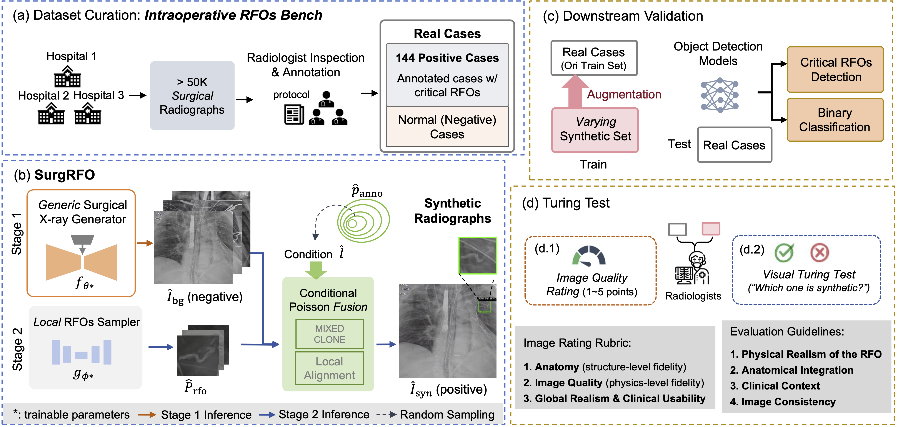

# SurgRFO: Compositional Synthesis of Critical Retained Foreign Objects in Intraoperative Chest X-rays

Official implementation of **SurgRFO**, a two-stage synthesis framework for generating realistic intraoperative radiographs with critical
retained foreign objects (RFOs).

Paper: *SurgRFO: Foundation Model Based Compositional Synthesis of Critical Retained Foreign Objects in Intraoperative Chest X-rays*\
Conference: Submitted to MICCAI 2026

------------------------------------------------------------------------

## Overview

Critical retained foreign objects (RFOs), such as surgical sponges or
needle fragments, are rare but high-risk patient safety events.
Detecting these objects in **intraoperative chest X-rays** is
challenging due to:

-   extremely limited positive samples
-   cluttered surgical scenes
-   weak visual signals
-   overlapping surgical instruments

To address this data scarcity problem, we introduce **SurgRFO**, a
structured synthesis pipeline that generates realistic RFO-positive
surgical radiographs for training detection models.

Unlike end-to-end generative pipelines, SurgRFO **decouples global
surgical context from local RFO appearance**, enabling high-fidelity
synthesis even with limited positive cases.

The project also releases **Intraoperative RFO Bench**, the first
dataset specifically curated for critical RFO detection.



------------------------------------------------------------------------

## Key Contributions

### 1. Intraoperative RFO Bench

-   First benchmark dedicated to **critical retained foreign objects**
-   Curated from **18 years of surgical radiographs**

RFOBench summary:

| Data | Count |
| --- | ---: |
| Positive RFO cases | 144 |
| Negative cases | 944 |
| External evaluation cases | 20 (negative 12 + positive 8) |

Annotations include:

-   image-level labels
-   object-level bounding boxes or masks

------------------------------------------------------------------------

### 2. SurgRFO Synthesis Framework

A **two-stage compositional generation pipeline**:

#### Stage 1 --- Surgical Background Generator

A latent diffusion model generates **RFO-free intraoperative X-ray
backgrounds**.

-   based on the RoentGen chest X-ray foundation model
-   adapted to surgical-domain radiographs
-   preserves anatomy, surgical tools, and imaging physics

#### Stage 2 --- Local RFO Sampler

A lightweight generator models **localized RFO appearance** using
patch-level learning.

Generated RFO patches are inserted using **conditional Poisson fusion**
to ensure photometric realism.

Synthetic image composition:

Synthetic X-ray = Background + Local RFO Patch + Poisson Blending

------------------------------------------------------------------------

## Pipeline

1.  Dataset curation and annotation
2.  Stage-1 surgical background synthesis
3.  Stage-2 local RFO patch generation
4.  Conditional Poisson fusion
5.  Synthetic dataset creation
6.  Downstream RFO detection training

------------------------------------------------------------------------

## Results

Synthetic augmentation improves detection performance across multiple
architectures.

| Model | Training Setup | mAP@0.3 | FNR |
| --- | --- | ---: | ---: |
| Faster R-CNN | Base | 0.184 | 78.8% |
| Faster R-CNN | +2000 synthetic | **0.510** | **33.3%** |
| RetinaNet | Base | 0.099 | 72.7% |
| RetinaNet | +2000 synthetic | **0.564** | **36.3%** |
| YOLOv8 | Base | 0.000 | 100% |
| YOLOv8 | +1000 synthetic | **0.357** | **60.6%** |

Synthetic data significantly reduces **false negatives**, which is
critical for patient safety.

------------------------------------------------------------------------

## Repository Structure

    SurgRFO/
    │
    ├── datasets/
    │   ├── RFOBench/
    │   └── preprocessing/
    │
    ├── stage1/
    │   ├── train_finetune_surgical.py
    │   ├── inference_surgical_image.py
    │   └── run_finetune.sh
    │
    ├── stage2/
    │   ├── make_rfo_patches.py
    │   ├── resize_sponge_png_64.py
    │   ├── poisson_fuse.py
    │   ├── fuse.sh
    │   ├── rfo_dataset.sh
    │   └── guided-diffusion/
    │
    ├── downstream/
    │   ├── fasterrcnn/
    │   ├── retinanet/
    │   └── yolov8/
    │
    ├── eval/
    │   ├── metrics.py
    │   └── froc.py
    │
    └── README.md

------------------------------------------------------------------------

## Installation

```bash
Repository: [link](https://github.com/xxx/SurgRFO.git)

git clone <REPO_URL>
cd SurgRFO
```

Create environment:

```bash
conda create -n surgrfo python=3.10
conda activate surgrfo
pip install -r requirements.txt
```

------------------------------------------------------------------------

## Data Preparation

### Real raw radiographs

- Raw radiographs can be provided and will be publicly released upon acceptance.
- During the rebuttal period, we provide 3 representative examples in the repo.

### Full benchmark + preprocessed dataset

We also release a complete benchmark and dataset (with unified preprocessing applied), containing **both real and synthetic data**:

- Benchmark & dataset link:
  - [link](https://anonymous-hf.up.railway.app/a/uzr6d9bsd0uo/)

The dataset is split as **6:1:3 (train/val/test)** and includes the following layout under the downloaded dataset root:

The split manifest CSV files provide detailed sample-level metadata (e.g., annotation label, and whether the sample is real or synthetic).
Each split folder contains the images and a corresponding per-image LabelMe JSON annotation file.

```
<RFO_BENCH_ROOT>/
  train/
  val/
  test/
  split_manifest_aug500.csv
  split_manifest_aug1000.csv
  split_manifest_aug2000.csv
  split_manifest_base.csv
  split_manifest_test_new.csv
```

Split policy and usage:

- `split_manifest_base.csv`
  - The training split is used for Stage-1/Stage-2 training and downstream training on base data（i.e. real data）.
- `split_manifest_aug500.csv`, `split_manifest_aug1000.csv`, `split_manifest_aug2000.csv`
  - Used for downstream training with synthetic augmentation.
  - All synthetic data are included in the training phase (inside `train/`).
- `val/` is used to select the best detection model.
- The entire pipeline is designed to avoid data leakage.

Note: the downstream training/testing scripts support `--manifest-name` or `--manifest-file` to choose a split manifest.

------------------------------------------------------------------------

## Generate Synthetic RFO Images

This repository provides a two-stage synthesis pipeline:

### Stage 1: Generate RFO-free surgical backgrounds

The Stage-1 scripts are located in `stage1/`:

- Fine-tune the background generator:

```bash
# Option A: direct
accelerate launch stage1/train_finetune_surgical.py

# Option B: helper shell script (Linux)
bash stage1/run_finetune.sh
```

- Sample background images:

```bash
python stage1/inference_surgical_image.py
```

Important: these Stage-1 scripts use a few hard-coded paths (e.g., training image folder, model checkpoint folder). Please edit the variables near the top of the scripts to match your local dataset/model locations.

### Stage 2: Train/sample local RFO patches, then fuse

The Stage-2 utilities are located in `stage2_new/`.

1) Prepare real RFO patch crops (from masks + original images):

```bash
python stage2_new/make_rfo_patches.py \
  --mask_dir ../data/critical_RFO_data/images_and_masks/mask512 \
  --img_dir  ../data/critical_RFO_data/images_and_masks/image512 \
  --csv      ../data/critical_RFO_data/images_and_masks/rfo_anno.CSV \
  --out_root ../data/critical_RFO_data/images_and_masks
```

Note: the output patch sizes are controlled by the `CFG` dict inside `stage2_new/make_rfo_patches.py`.

2) (Optional) Resize patch PNGs to 64×64:

```bash
# The default input/output paths in this script are relative to the current working directory.
# Recommended: run it from inside stage2_new/
cd stage2_new
python resize_sponge_png_64.py

# Or override input/output via environment variables
#   RFO_STAGE2_SRC_DIR: directory containing *.png
#   RFO_STAGE2_DST_DIR: output directory
```

3) Train a diffusion model to sample RFO patches (guided-diffusion):

- Training entrypoint: `stage2_new/guided-diffusion/image_train.py`
- Example SLURM script: `stage2_new/guided-diffusion/rfo_adm.sh`

```bash
cd stage2_new/guided-diffusion

# Example: run the provided script (edit --data_dir and flags in the .sh as needed)
bash rfo_adm.sh
```

4) Sample synthetic RFO patches:

- Sampling entrypoint: `stage2_new/guided-diffusion/image_sample.py`
- Example SLURM script: `stage2_new/guided-diffusion/rfo_sample.sh`

```bash
cd stage2_new/guided-diffusion
bash rfo_sample.sh
```

5) Fuse sampled RFO patches onto Stage-1 backgrounds (Poisson blending):

- Fusion script: `stage2_new/poisson_fuse.py`

Single image example:

```bash
python stage2_new/poisson_fuse.py \
  --xray   <PATH_TO_ONE_STAGE1_BACKGROUND.png> \
  --rfo-img <PATH_TO_ONE_RFO_PATCH.png> \
  --rfo-mask none \
  --rfo-target-size 64 \
  --mode mixed --feather 3 \
  --center 450,120 \
  --out ./stage2_fused/single_001.png
```

Batch example:

```bash
python stage2_new/poisson_fuse.py \
  --xray-dir <STAGE1_BACKGROUND_DIR> \
  --rfo-dir  <RFO_PATCH_DIR> \
  --mask-dir none \
  --rfo-target-size 64 \
  --mode mixed --feather 3 \
  --center 360,200 \
  --out-dir ./stage2_fused \
  --pairing one_to_one
```

------------------------------------------------------------------------

## Train Detection Models

All detection baselines are under `downstream/` and assume a dataset root with:

- `train/`, `val/`, `test/` folders (each contains LabelMe JSON + corresponding images)
- split manifests (CSV) in the dataset root (optional but recommended)

### (1) Test with pretrained detectors

You can directly evaluate with the released pretrained checkpoints:

- Faster R-CNN and RetinaNet checkpoints: [link](https://anonymous-hf.up.railway.app/a/uzr6d9bsd0uo/)

After downloading, run:

```bash
# Faster R-CNN
python downstream/fasterrcnn/test.py \
  --data-root <RFO_BENCH_ROOT> \
  --manifest-name split_manifest_base.csv \
  --ckpt <PATH_TO_DOWNLOADED_frcnn_checkpoint.pt> \
  --split test \
  --out-dir ./runs/frcnn_test

# RetinaNet
python downstream/retina/test.py \
  --data-root <RFO_BENCH_ROOT> \
  --manifest-name split_manifest_base.csv \
  --ckpt <PATH_TO_DOWNLOADED_retina_checkpoint.pt> \
  --split test \
  --out-dir ./runs/retina_test
```

To evaluate the alternate test subset, use:

```bash
python downstream/fasterrcnn/test.py --data-root <RFO_BENCH_ROOT> --manifest-name split_manifest_test_new.csv --ckpt <...> --split test
python downstream/retina/test.py     --data-root <RFO_BENCH_ROOT> --manifest-name split_manifest_test_new.csv --ckpt <...> --split test
```

### (2) Train your own detectors

Faster R-CNN training:

```bash
# Base training (real-only or base mixture as defined by the manifest)
python downstream/fasterrcnn/train.py \
  --data-root <RFO_BENCH_ROOT> \
  --manifest-name split_manifest_base.csv \
  --out-dir ./runs/frcnn_base \
  --epochs 50 --batch-size 4 --lr 5e-4 --device cuda

# Augmented training (choose one)
python downstream/fasterrcnn/train.py --data-root <RFO_BENCH_ROOT> --manifest-name split_manifest_aug500.csv  --out-dir ./runs/frcnn_aug500
python downstream/fasterrcnn/train.py --data-root <RFO_BENCH_ROOT> --manifest-name split_manifest_aug1000.csv --out-dir ./runs/frcnn_aug1000
python downstream/fasterrcnn/train.py --data-root <RFO_BENCH_ROOT> --manifest-name split_manifest_aug2000.csv --out-dir ./runs/frcnn_aug2000
```

RetinaNet training:

```bash
# Base training
python downstream/retina/train.py \
  --data-root <RFO_BENCH_ROOT> \
  --manifest-name split_manifest_base.csv \
  --out-dir ./runs/retina_base \
  --epochs 50 --batch-size 4 --lr 5e-4 --device cuda

# Augmented training (choose one)
python downstream/retina/train.py --data-root <RFO_BENCH_ROOT> --manifest-name split_manifest_aug500.csv  --out-dir ./runs/retina_aug500
python downstream/retina/train.py --data-root <RFO_BENCH_ROOT> --manifest-name split_manifest_aug1000.csv --out-dir ./runs/retina_aug1000
python downstream/retina/train.py --data-root <RFO_BENCH_ROOT> --manifest-name split_manifest_aug2000.csv --out-dir ./runs/retina_aug2000
```

(Optional) YOLOv8 training/testing scripts are also provided under `downstream/yolov8/`.
